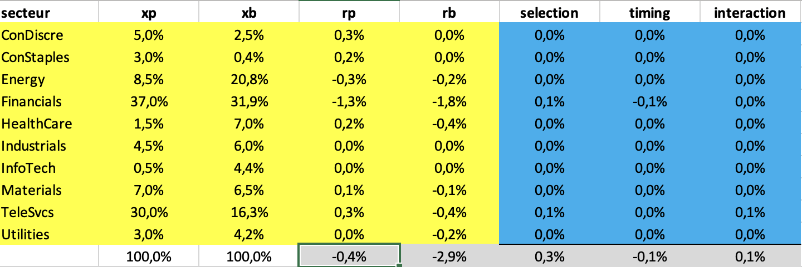

{: .box-success}
**Attribution of Performance** is a project that implements the Brinson performance attribution methodology using VBA within Excel. It provides a detailed analysis of portfolio performance, breaking down returns into selection, market timing, and interaction effects. The tool is designed to help portfolio managers and analysts gain insights into the drivers of their portfolio's performance relative to a benchmark.

---

## **Repository**

Explore the full source code on GitHub:

---

## **Key Features**

### 1. **Data Extraction and Preparation**
{: .box-note}
- A VBA module automates the extraction of relevant data, including:
  - Monthly stock returns.
  - Portfolio and benchmark weights.
  - Sector classifications.
- Data is retrieved from a provided Excel sheet using the `mod_recup_data.bas` script.

### 2. **Brinson Attribution Calculations**
{: .box-note}
- Implements the Brinson methodology to analyze performance attribution by sector.
- Calculates:
  - Sector weights in the portfolio and benchmark.
  - Sector returns in the portfolio and benchmark.
  - Attribution effects:
    - **Selection Effect**: Impact of stock selection within sectors.
    - **Market Timing Effect**: Impact of sector weight allocation.
    - **Interaction Effect**: Combined impact of selection and allocation.

### 3. **Interactive and Automated Workflow**
{: .box-note}
- Fully automates the calculation process:
  - Sorts data by sector for efficient processing.
  - Aggregates sector-level metrics using `CountIf` and `SumProd` functions.
  - Outputs results in a user-friendly "Attribution" worksheet.

### 4. **Comprehensive Results**
{: .box-success}
- The final output includes:
  - Total portfolio return, benchmark return, and attribution breakdown.
  - Sector-level performance analysis.
- Provides validation to ensure the sum of all attribution effects matches the total portfolio return difference.

---

## **Project Structure**

### **Main Components**
- **mod_recup_data.bas**: Handles data extraction from the input file and prepares it for analysis.
- **attribution_performances.bas**: Core script for implementing the Brinson attribution methodology.
- **Excel Template**: A structured workbook for data input, intermediate calculations, and final results.

---

## **Interactive Results**

{: .box-success}
The tool generates detailed tables in Excel, including:

- **Sector-Level Analysis**: Displays weights, returns, and attribution effects for each sector.
- **Portfolio Overview**: Summarizes total returns and the breakdown of attribution effects.
- **Visualization Ready**: Results can be exported or visualized for presentations and reports.

Example Output:

---

## **Getting Started**

1. Download the project files from GitHub:
   [Attribution of Performance Repository](https://github.com/guilhembarroyer/attribution-performance)
   
2. Open the Excel template and run the provided VBA macros:
   - **mod_recup_data.bas** for data extraction.
   - **attribution_performances.bas** for attribution analysis.

3. Customize the input data (e.g., stock universe, dates) and run the analysis to generate sector-level attribution insights.

---

This project offers a practical implementation of portfolio performance attribution, leveraging VBA for automation and Excel for interactive analysis.
