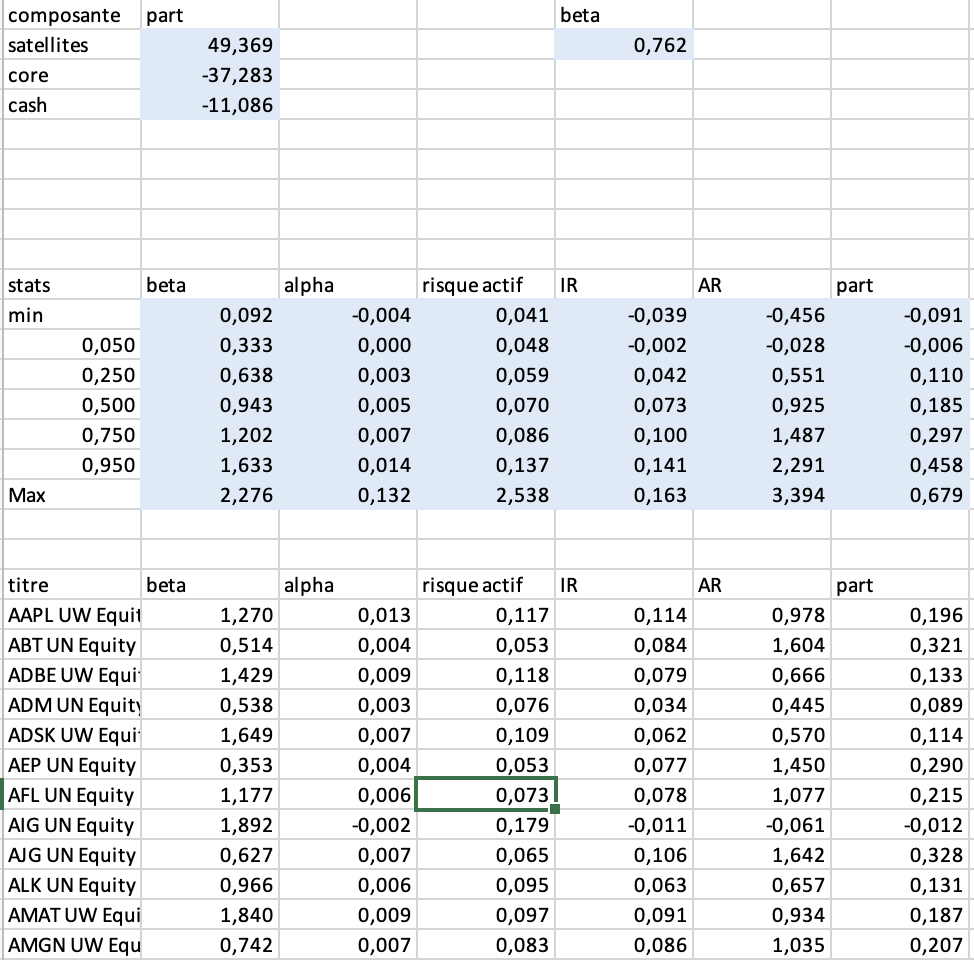

{: .box-success}
**Core-Satellites Allocation VBA Model** is a project that implements the core-satellites investment strategy. The model optimizes the allocation between a central portfolio of index-based assets (core), selected actively managed securities (satellites), and a cash position, offering an effective balance between passive and active investment management.

---

## **Repository**

Explore the full source code and Excel file on GitHub:

---

## **Key Features**

### 1. **Automated Data Integration**
{: .box-note}
- Recovers historical data for stocks, market indices, and monetary indices from dedicated Excel sheets.
- Prepares the dataset for further calculations, including:
  - **Stock returns** for actively managed securities.
  - **Market index returns** for the core portfolio.
  - **Monetary index returns** for cash allocation.

### 2. **Portfolio Optimization**
{: .box-note}
- Dynamically allocates weights between:
  - **Core portfolio** (passive index-based investments).
  - **Satellite portfolio** (actively managed stocks with alpha potential).
  - **Cash** (for liquidity management).
- Balances active risk exposure using calculated alphas, betas, and CAPM principles.

### 3. **Performance Metrics**
{: .box-note}
- Evaluates strategies using key financial metrics:
  - **Alpha**: Excess return relative to CAPM predictions.
  - **Beta**: Risk measure compared to the market.
  - **Information Ratio (IR)**: Returns adjusted for tracking error.
  - **Appraisal Ratio (AR)**: Alpha per unit of active risk.
- Outputs performance summaries in a user-friendly table.

### 4. **Interactive Results**
{: .box-note}
- Summarizes allocation decisions and portfolio performance in a clean Excel interface.
- Offers detailed insights into the contribution of individual securities to overall returns.

---

## **Project Structure**

### **Main VBA Modules**
- **`main`**: Manages the data retrieval process, including importing stock and index returns from Excel sheets.
- **`imp_data`**: Organizes and validates input data for calculations.
- **`coreSatellites`**: Core allocation algorithm, computing weights for the core portfolio, satellite securities, and cash.
- **`calcul_alphas`**: Calculates alphas and betas for securities using CAPM methodology.
- **`calcul_rendements`**: Computes historical returns for each asset.

---

## **How It Works**

1. **Data Preparation**:
   - Import stock and index data from Excel sheets.
   - Pre-process data for compatibility with the allocation algorithm.

2. **Portfolio Allocation**:
   - Compute CAPM-based alphas and betas for each asset.
   - Optimize weights between core, satellites, and cash positions.
   - Adjust allocations dynamically based on user-defined parameters (e.g., risk tolerance).

3. **Performance Analysis**:
   - Summarize results in a structured Excel sheet.
   - Highlight key financial metrics for decision-making.

---

## **Interactive Results**

{: .box-success}
- **Customizable Parameters**: Adjust risk tolerance, target betas, and other variables to tailor the strategy.
- **Result Visualization**: Export allocation results and performance metrics for further analysis.

Example Table Output:

---

## **Getting Started**

### Prerequisites
- Microsoft Excel (with macro support enabled).
- Basic understanding of portfolio management and VBA programming.

### Installation
1. Clone the repository or download the project files.
2. Open the `Core_Satellites.xlsm` Excel file.
3. Enable macros in Excel to run the VBA modules.

### Usage
1. Run the `main` macro to initialize the process and retrieve data.
2. Execute the `coreSatellites` macro to compute the portfolio allocation.
3. Review the results in the "core-satellites" sheet for insights and decision-making.

---

## **Conclusion**

The **Core-Satellites Allocation VBA Model** provides a practical solution for investors seeking to balance active and passive strategies. By leveraging Excel and VBA, this project offers an accessible tool for portfolio optimization and performance evaluation.
